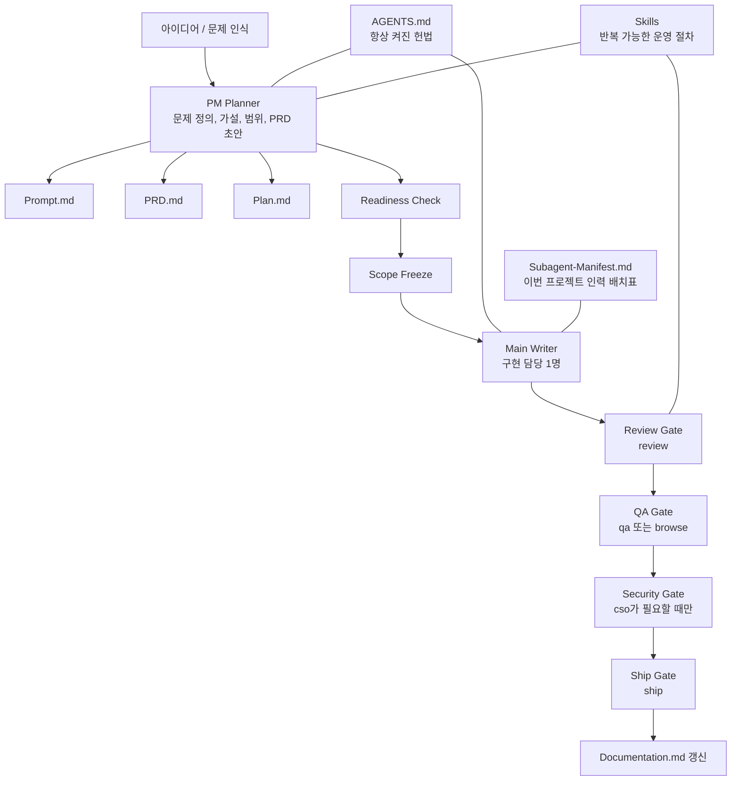
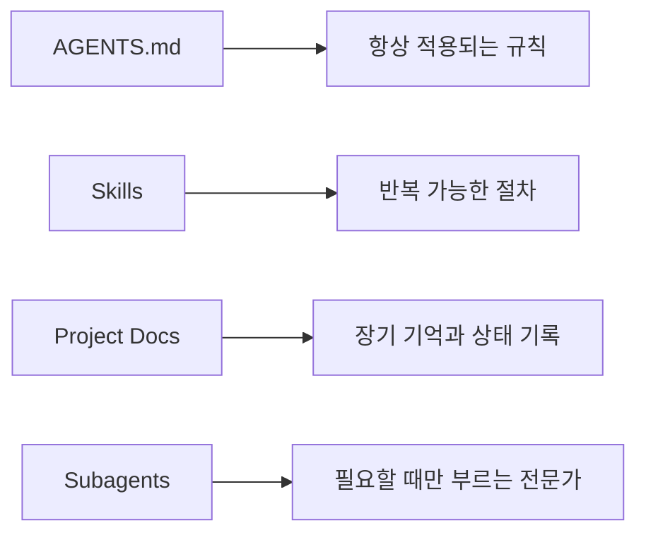

# vibebuilder-framework

vibebuilder-framework는 PM-first planning, single-writer execution, dynamic oversight, and gated review를 중심으로 에이전트 기반 제품 개발을 운영하는 바이브코딩 프레임워크입니다.

짧게 말하면 이 저장소는 "에이전트를 많이 쓰는 법"이 아니라 "언제 기획을 잠그고, 누가 구현을 맡고, 어떤 기준으로 검증할지"를 정리한 실전용 개발 프레임워크입니다.

## 왜 이 저장소를 만들었나

바이브코딩은 빠릅니다. 하지만 프로젝트가 길어질수록 같은 문제가 반복됩니다.

- 좋은 아이디어인데 문제 정의가 흐립니다.
- 중간에 범위가 계속 바뀌어서 다시 만듭니다.
- 여러 에이전트를 붙였더니 오히려 충돌이 납니다.
- 채팅창에만 의존해서 며칠 뒤 맥락 복구가 어렵습니다.
- 마지막 검토가 약해서 데모는 되는데 제품 품질은 흔들립니다.

vibebuilder-framework는 이 문제를 줄이기 위해 만들었습니다. 목표는 속도를 죽이는 절차가 아니라, 재작업을 줄이고 결과물의 완성도를 올리는 구조를 만드는 것입니다.

## 이 저장소가 택한 답

이 저장소는 아래 구조를 기본값으로 둡니다.

- 시작은 `PM planner`가 맡습니다.
- 구현은 `writer 1명`이 맡습니다.
- 검토는 `gstack 스타일 게이트`로 나눕니다.
- 기억은 채팅이 아니라 `문서 파일`에 남깁니다.
- 에이전트는 상시 군단이 아니라 `필요할 때만 채용`합니다.

이 구조는 "늘 더 많은 에이전트"보다 훨씬 안정적입니다. 역할이 분리되어 있고, 각 단계의 책임이 명확하기 때문입니다.

## 전체 구조



## 도구 역할 분리

이 저장소는 도구를 겹치게 쓰지 않고 역할별로 나눕니다.

- `planner-capable agent`: 아이디어 확장, 선택지 비교, 문제 재정의
- `writer-capable agent`: 저장소 맥락 기반 구현, 수정, 검증
- `PM planner`: 기획 정리, 범위 통제, readiness 판단
- `gstack 스타일 게이트`: review, QA, browse, ship 같은 후반 품질 잠금

이렇게 나누면 같은 문제를 여러 도구가 중복해서 건드리는 일이 줄고, 각 도구를 가장 잘하는 일에 쓸 수 있습니다.

## 빠른 시작

처음 이 저장소를 열었을 때는 아래 순서로 보면 된다.

1. [AGENTS.md](./AGENTS.md)로 전체 운영 규칙을 읽는다.
2. [.agents/skills/product-planner/SKILL.md](./.agents/skills/product-planner/SKILL.md)로 기획 흐름을 본다.
3. [.agents/skills/vibe-coding-workflow/SKILL.md](./.agents/skills/vibe-coding-workflow/SKILL.md)로 구현 흐름을 본다.
4. [.agents/skills/gstack-gates/SKILL.md](./.agents/skills/gstack-gates/SKILL.md)로 후반 검수 게이트를 본다.
5. [templates](./templates)에서 문서 템플릿을 복사해 프로젝트를 시작한다.
6. [docs/MODES.md](./docs/MODES.md)에서 작업 강도를 고른다.
7. [docs/OVERSIGHT_POLICY.md](./docs/OVERSIGHT_POLICY.md)에서 이번 작업의 감독 계획을 정한다.
8. [docs/PIVOT_POLICY.md](./docs/PIVOT_POLICY.md)에서 구현 중 변경을 어떻게 처리할지 확인한다.

## 새 프로젝트에 어떻게 적용하나

이 프레임워크는 별도 참고용 폴더로 옆에 두는 방식보다, 새 프로젝트의 `root`에 같이 넣고 시작하는 방식이 가장 좋다.

예를 들어 새 프로젝트가 `my-app`이라면 구조는 이렇게 된다.

```text
my-app/
  AGENTS.md
  .agents/skills/...
  docs/...
  templates/...
  Prompt.md
  PRD.md
  Plan.md
  Implement.md
  Documentation.md
  src/...
  package.json
```

즉, 코드와 문서와 agent 규칙이 같은 프로젝트 폴더 안에 같이 있어야 한다.

이 방식을 권장하는 이유는 단순하다.

- agent가 프로젝트를 열자마자 `AGENTS.md`와 `.agents/skills`를 바로 읽을 수 있다.
- 코드와 계획 문서가 같은 레포에 있어서 맥락이 끊기지 않는다.
- 작업 규칙, 기획, 구현, 검증 기록이 한곳에 모인다.

반대로 아래처럼 프레임워크를 옆 폴더에 따로 두는 방식은 비추천이다.

```text
workspace/
  vibebuilder-framework/
  my-app/
```

이렇게 두면 규칙은 한 폴더에 있고 실제 코드는 다른 폴더에 있어서, 프로젝트가 길어질수록 오히려 관리가 불편해진다.

## 5분 안에 시작하는 절차

새 프로젝트를 시작할 때는 아래처럼 하면 된다.

1. 새 프로젝트 폴더를 만든다.
2. 이 프레임워크의 `AGENTS.md`, `.agents/skills`, `docs`, `templates`를 그 프로젝트 `root`에 복사한다.
3. `templates/Prompt.md`, `templates/PRD.md`, `templates/Plan.md`, `templates/Implement.md`, `templates/Documentation.md`를 프로젝트 root에 실제 작업 파일로 복사한다.
4. [docs/MODES.md](./docs/MODES.md)를 보고 이번 작업의 mode를 고른다. 확신이 없으면 `solo-pro`로 시작한다.
5. `product-planner`로 첫 기획을 정리하면서 `Prompt.md`, `PRD.md`, `Plan.md`를 채운다.
6. [docs/OVERSIGHT_POLICY.md](./docs/OVERSIGHT_POLICY.md)에 따라 이번 작업의 oversight plan을 선언한다.
7. `scope freeze` 후 `Implement.md`의 sprint contract를 채우고 구현을 시작한다.
8. 구현이 끝나면 `review`, `qa/browse`, `security if needed`, `ship` 순서로 게이트를 통과시킨다.

정말 짧게 줄이면 이렇다.

- 프레임워크 파일을 프로젝트 root에 넣는다
- 템플릿을 실제 작업 문서로 복사한다
- planner로 기획을 고정한다
- sprint contract를 적고 구현한다
- review와 QA를 거쳐 마무리한다

## 왜 이 구성이 좋은가

### 1. 처음부터 코드를 치지 않게 막아준다

많은 실패는 구현 속도가 느려서가 아니라, 잘못된 문제를 빠르게 풀어서 생깁니다. 그래서 이 저장소는 `PM planner`를 먼저 둡니다. planner의 역할은 문서를 길게 쓰는 것이 아니라, 무엇을 만들지보다 먼저 왜 만드는지와 어디까지 만들지를 명확히 하는 것입니다.

### 2. 구현 충돌을 줄인다

코드를 실제로 크게 쓰는 주체는 한 명으로 제한합니다. 여러 writer가 같은 경로를 동시에 고치면 속도가 나는 것처럼 보여도, 실제로는 충돌과 재정렬 비용이 더 큽니다. 그래서 `writer 1명, 나머지는 평가자` 구조를 기본으로 잡습니다.

### 3. 평가자는 매 순간 끼어들지 않고 게이트에서만 작동한다

planner나 reviewer가 매 대화 턴마다 들어오면 흐름이 끊깁니다. 반대로 아예 없으면 품질이 흔들립니다. 이 저장소는 그 중간이 아니라, 더 분명한 방식을 택합니다. `문제 정의`, `PRD`, `scope freeze`, `구현 후 review`, `QA`, `ship` 같은 산출물 단위에서만 평가를 수행합니다.

### 4. 긴 프로젝트에서 맥락 복구가 쉬워진다

장기 프로젝트는 결국 기억의 싸움입니다. 이 저장소는 중요한 맥락을 채팅창에 두지 않습니다. 목표는 `Prompt.md`, 계획은 `Plan.md`, 실행 규칙은 `Implement.md`, 상태와 결정은 `Documentation.md`에 남깁니다. 그래서 며칠 뒤 다시 들어와도 어디서 멈췄는지 빠르게 복구할 수 있습니다.

### 5. gstack와 PM skills를 각자 잘하는 곳에만 쓴다

이 저장소는 외부 프레임워크를 그대로 복제하지 않습니다.

- `PM skills`는 초기 문제 정의와 기획 구조화에 강합니다.
- `gstack`는 review, QA, browse, ship 같은 후반 품질 게이트에 강합니다.
- `AGENTS.md`는 저장소 전체 규칙을 고정하는 데 적합합니다.

즉, 각 도구를 전부 다 쓰는 것이 아니라, 가장 잘 맞는 위치에 배치합니다.

## 이 저장소의 기본 레이어



각 레이어의 역할은 아래처럼 분리합니다.

- `AGENTS.md`: 언어, 협업 방식, 검증 원칙, one-writer 원칙 같은 헌법
- `SKILL.md`: planner, execution, review gate처럼 반복되는 운영 절차
- `Project Docs`: 목표, 계획, 실행 규칙, 상태, 결정 로그
- `Subagents`: 코드맵, 리뷰, QA, 보안, 브라우저 재현 같은 특정 역할

## 이 저장소가 가정하는 기본 워크플로

1. 아이디어를 받는다.
2. `PM planner`가 문제 정의와 범위를 정리한다.
3. `Prompt.md`, `PRD.md`, `Plan.md`를 고정한다.
4. `Scope Freeze` 이후 메인 writer가 구현한다.
5. 구현이 끝나면 `review`를 통과한다.
6. 웹이나 UI가 있으면 `qa` 또는 `browse`로 실제 흐름을 검증한다.
7. 민감 기능이면 `cso`로 보안 점검을 한다.
8. `ship`으로 마무리하고 `Documentation.md`를 갱신한다.

## 누구에게 맞는가

- 혼자서 제품을 빠르게 만들지만, 결과물 품질도 포기하고 싶지 않은 사람
- 여러 AI coding agent를 같이 쓰지만 역할 분리가 필요한 사람
- 아이디어가 자주 커져서 범위 통제가 필요한 사람
- 한 프로젝트를 며칠, 몇 주 이상 길게 끌고 가는 사람

## 이 저장소가 최적이라고 보는 이유

이 저장소가 생각하는 "최적"은 가장 가벼운 구조가 아닙니다. 가장 덜 잊고, 가장 덜 다시 만들고, 가장 덜 흔들리면서도 계속 앞으로 가는 구조를 뜻합니다.

그래서 vibebuilder-framework는 다음을 목표로 합니다.

- 생각은 빠르게 하되, 범위는 분명하게
- 구현은 과감하게 하되, 책임은 한 곳에
- 검토는 늦지 않게 하되, 흐름은 끊지 않게
- 기억은 대화에 맡기지 말고 파일에 남기기

## 현재 저장소 구조

- [AGENTS.md](./AGENTS.md): 저장소 전체 운영 헌법
- [.agents/skills/product-planner/SKILL.md](./.agents/skills/product-planner/SKILL.md): PM-first 기획 정리
- [.agents/skills/vibe-coding-workflow/SKILL.md](./.agents/skills/vibe-coding-workflow/SKILL.md): single-writer 구현 루프
- [.agents/skills/gstack-gates/SKILL.md](./.agents/skills/gstack-gates/SKILL.md): review, QA, security, ship 게이트
- [templates](./templates): Prompt, PRD, Plan, Implement, Documentation, Manifest 템플릿
- [docs](./docs): 운영 모델, artifact gate, subagent 정책, mode, oversight, pivot 정책, 레퍼런스 해석

## 레퍼런스와 해석

이 저장소는 아래 레퍼런스를 그대로 포크하지 않고, 각 레포가 가장 잘하는 부분만 가져와 재구성합니다.

- [phuryn/pm-skills](https://github.com/phuryn/pm-skills): discovery, assumption mapping, PRD와 execution 구조화
- [garrytan/gstack](https://github.com/garrytan/gstack): office-hours식 문제 재정의, CEO/eng/design review, review/qa/browse/ship 게이트
- [agentsmd/agents.md](https://github.com/agentsmd/agents.md): 예측 가능한 전역 agent 지시 파일 패턴

이 레퍼런스를 어떻게 해석했는지는 [docs/REFERENCE_ALIGNMENT.md](./docs/REFERENCE_ALIGNMENT.md)에 정리해두었습니다.

## 한 문장 요약

vibebuilder-framework는 PM planner로 방향을 고정하고, 메인 writer가 구현하고, 동적 감독과 gstack 스타일 게이트로 품질을 잠그는 프로급 바이브코딩 프레임워크입니다.
