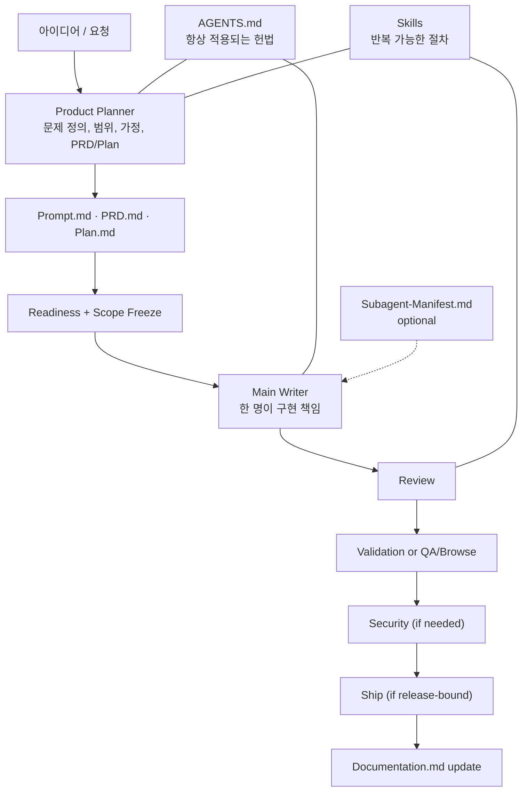
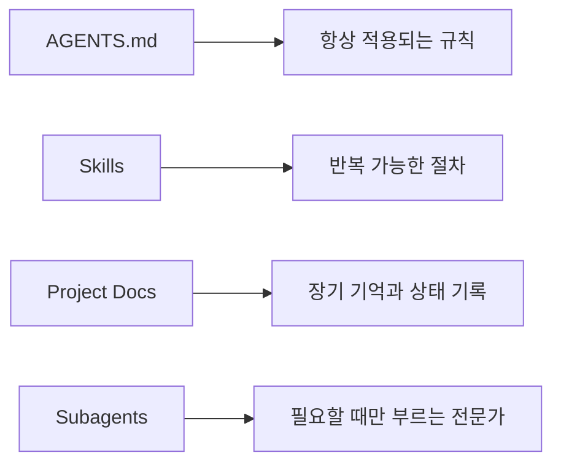

# vibebuilder-framework

> A PM-first soft harness for solo vibe coding.

vibebuilder-framework는 혼자 제품을 만들 때, 아이디어를 바로 코드로 밀어 넣기보다 먼저 방향을 맞추고, 구현 책임을 한 곳에 모으고, 마지막에 품질 게이트로 잠그게 만드는 실전 프레임워크입니다.

이 저장소의 목표는 에이전트를 더 많이 쓰는 것이 아닙니다. 더 적은 재작업으로, 더 덜 흔들리고, 더 완성도 있게 끝내는 것입니다.

## 목차

- [무엇인가](#무엇인가)
- [어떤 문제를 풀려는가](#어떤-문제를-풀려는가)
- [기대효과](#기대효과)
- [핵심 작동 방식](#핵심-작동-방식)
- [왜 PM-first soft harness인가](#왜-pm-first-soft-harness인가)
- [핵심 원칙](#핵심-원칙)
- [어떻게 사용하는가](#어떻게-사용하는가)
- [문서와 레이어](#문서와-레이어)
- [도구 배치](#도구-배치)
- [게이트 사용법](#게이트-사용법)
- [작업 모드](#작업-모드)
- [예시](#예시)
- [레퍼런스](#레퍼런스)

## 무엇인가

이 프레임워크는 혼자 바이브코딩할 때 생기는 세 가지 문제를 동시에 다룹니다.

- 처음 방향을 잘못 잡아서 다시 만드는 문제
- 구현 중 범위가 조용히 커지는 문제
- 끝나고 보니 검수와 마감이 비어 있는 문제

그래서 기본 구조를 이렇게 둡니다.

- 시작은 `PM planner`
- 구현은 `main writer` 1명
- 품질 잠금은 `review -> validation 또는 qa/browse -> security -> ship`
- 기억은 채팅이 아니라 `프로젝트 문서`

짧게 말하면, 이 저장소는 `혼자 만드는 사람을 위한 PM-first build framework`입니다.

## 어떤 문제를 풀려는가

바이브코딩은 빠르지만, 프로젝트가 길어질수록 같은 문제가 반복됩니다.

- 문제 정의가 흐려서 잘못된 걸 빠르게 만든다.
- 구현하다가 아이디어가 자꾸 커져서 다시 만든다.
- 여러 에이전트를 붙였더니 오히려 충돌한다.
- 채팅창에만 의존해서 며칠 뒤 맥락 복구가 어렵다.
- 마지막 점검이 약해서 데모는 되는데 제품 품질은 흔들린다.

vibebuilder-framework는 속도를 늦추려는 절차가 아니라, `재작업을 줄이고 완주 확률을 높이기 위한 구조`다.

## 기대효과

이 프레임워크를 쓰면 보통 아래 효과를 기대할 수 있습니다.

- 무엇을 만들지 더 빨리 명확해진다.
- 구현 중 범위가 새는 일이 줄어든다.
- 여러 도구를 써도 역할이 덜 겹친다.
- 세션을 다시 열었을 때 어디서 이어야 할지 빨리 보인다.
- 끝나기 전에 빠진 것, 회귀, 검증 누락을 한 번 더 잡을 수 있다.

핵심은 `더 빨리 타이핑하는 것`이 아니라 `덜 틀리고, 덜 잊고, 덜 다시 만드는 것`입니다.

## 핵심 작동 방식

이 흐름의 핵심은 간단합니다.

- 기획이 약하면 구현을 늦춘다.
- 구현이 시작되면 한 사람이 책임지고 민다.
- 끝날 때는 품질 게이트로 잠근다.

## 왜 PM-first soft harness인가

이 프레임워크는 `하드 하네스`가 아닙니다. 즉, 런타임에서 모든 행동을 기술적으로 막는 시스템은 아닙니다.

대신 `soft harness`입니다.

- `AGENTS.md`가 기본 규칙을 고정합니다.
- `skills`가 반복 절차를 고정합니다.
- `templates`가 출력 형식을 고정합니다.
- `examples`가 실제 사용 예시를 보여줍니다.

즉, 사람과 에이전트가 같은 구조로 생각하게 만드는 쪽에 가깝습니다. 혼자 바이브코딩할 때는 처음부터 무거운 강제 시스템보다, `낮은 마찰로 계속 따를 수 있는 구조`가 더 현실적이라고 봤습니다.

더 강한 자동 강제 방향은 [docs/HOOKS_DESIGN.md](./docs/HOOKS_DESIGN.md)에 별도 설계안으로 정리해두었습니다.

## 핵심 원칙

- `PM-first`: 구현보다 먼저 문제 정의와 범위를 정리한다.
- `planner-of-record`: 최종 구현 기준 문서를 쓰는 planner는 하나로 고정한다.
- `single writer`: 실제 write path를 크게 소유하는 writer는 한 명만 둔다.
- `dynamic oversight`: 모든 작업에 같은 평가 렌즈를 강제하지 않는다.
- `validation before finish`: UI가 없으면 validation, UI가 있으면 qa/browse를 쓴다.
- `docs as memory`: 장기 맥락은 채팅이 아니라 문서에 남긴다.
- `subagents only when needed`: 상시 군단을 두지 않는다.
- `pivot is explicit`: 바뀐 범위는 숨기지 말고 기록하고 재판정한다.

## 어떻게 사용하는가

### 새 프로젝트 시작

1. 새 프로젝트 `root`에 `AGENTS.md`, `.agents/skills`, `docs`, `templates`를 복사합니다.
2. `templates`에서 `Prompt.md`, `PRD.md`, `Plan.md`, `Implement.md`, `Documentation.md`를 실제 작업 파일로 만듭니다.
3. [docs/MODES.md](./docs/MODES.md)에서 mode를 고릅니다. 확신이 없으면 `solo-pro`가 기본값입니다.
4. `product-planner`로 `Prompt.md`, `PRD.md`, `Plan.md`를 채웁니다.
5. [docs/OVERSIGHT_POLICY.md](./docs/OVERSIGHT_POLICY.md)에 따라 oversight plan을 선언합니다.
6. readiness와 scope freeze를 통과한 뒤 구현에 들어갑니다.
7. `Implement.md`에 현재 slice와 sprint contract를 적고, 메인 writer 한 명이 구현합니다.
8. 구현 후 `review`, `validation 또는 qa/browse`, `security if needed`, `ship if release-bound` 순서로 정리합니다.

### 진행 중 프로젝트에 도입

1. 현재 코드와 기존 문서를 먼저 읽습니다.
2. 지금 상태 기준으로 `Prompt.md`, `PRD.md`, `Plan.md`, `Documentation.md`를 역으로 채웁니다.
3. 지금 진행 중인 slice만 `Implement.md`에 적습니다.
4. mode와 oversight plan을 선언합니다.
5. 그다음부터 이 프레임워크 흐름으로 이어갑니다.

### 정말 짧은 시작 절차

- 문서를 만든다
- planner로 방향을 고정한다
- scope freeze를 한다
- writer 한 명이 구현한다
- review와 validation으로 마무리한다

## 문서와 레이어

각 레이어의 역할은 아래와 같습니다.

- [AGENTS.md](./AGENTS.md): 언어, 협업 방식, one-writer 원칙, 필수 게이트 같은 헌법
- [.codex/config.toml](./.codex/config.toml): repo-local hooks 기능 활성화
- [.codex/hooks.json](./.codex/hooks.json): SessionStart / Stop hook 연결
- [.codex/hooks/](./.codex/hooks): 현재 시범 구현된 hook 스크립트
- [.vibebuilder/runtime.json](./.vibebuilder/runtime.json): hooks가 읽는 최소 control plane 상태
- [.agents/skills/](./.agents/skills): planner, implementation, review, debugging 같은 반복 절차
- [templates](./templates): 새 프로젝트를 시작할 때 쓰는 문서 출발점
- [docs](./docs): mode, oversight, pivot, gate, tool mapping 같은 운영 원리
- [docs/HOOKS_DESIGN.md](./docs/HOOKS_DESIGN.md): Codex hooks로 soft harness를 더 강하게 만드는 설계안
- `Subagent-Manifest.md`: 역할과 write scope를 문서화해야 할 때만 쓰는 선택 문서

## 도구 배치

이 프레임워크는 도구 이름보다 `역할`을 먼저 봅니다.

- `planner-capable agent`: 문제 정의, 대안 비교, 범위 통제
- `writer-capable agent`: 저장소 맥락 기반 구현, 수정, 검증
- `validation-capable agent`: 테스트, API, CLI, runtime check
- `browser-capable agent`: 실제 UI 흐름 재현

혼자 Codex app을 주로 쓴다면 기본 추천은 이렇습니다.

- 발산: ChatGPT 또는 Claude Code
- 문서 확정: Codex의 `product-planner`
- 구현: Codex
- review/validation: Codex의 별도 턴

중요한 점은 `exploration partner`와 `planner-of-record`를 구분하는 것입니다. 다른 도구와 많이 이야기해도, 마지막에는 repo 안 문서로 수렴해야 합니다.

자세한 배치는 [docs/TOOL_MAPPING.md](./docs/TOOL_MAPPING.md)를 보면 됩니다.

## 게이트 사용법

이 프레임워크는 게이트를 대화 중간마다 끼워 넣지 않습니다. 산출물이 생겼을 때만 실행합니다.

- `review`: 구현 누락, 버그, 회귀 가능성
- `validation`: 테스트, API, CLI, runtime check
- `qa/browse`: 실제 UI 흐름 재현
- `security`: 인증, 권한, 결제, 업로드, 데이터 민감 변경
- `ship`: merge 또는 release 대상일 때만 최종 정리

핵심은 이겁니다.

- UI 없는 작업: `review -> validation`
- UI 있는 작업: `review -> qa/browse`
- 민감 변경: `security` 추가
- 실제 릴리스 대상: `ship` 추가

자세한 기준은 [docs/ARTIFACT_GATES.md](./docs/ARTIFACT_GATES.md)를 보면 됩니다.

## 작업 모드

이 프레임워크는 모든 작업에 같은 무게를 강제하지 않습니다.

- `solo-lite`: 작은 수정, 빠른 실험, 명백한 버그 수정
- `solo-pro`: 기본 권장 모드. 대부분의 실제 제품 개발
- `team`: 역할 분리와 병렬 작업이 필요한 경우

확신이 없으면 `solo-pro`로 시작하는 것이 가장 무난합니다. 자세한 기준은 [docs/MODES.md](./docs/MODES.md)를 보면 됩니다.

## 왜 이렇게 설계했는가

이 저장소는 외부 레퍼런스를 그대로 포크하지 않고, 각 레퍼런스가 가장 잘하는 부분만 가져와 재구성합니다.

- [phuryn/pm-skills](https://github.com/phuryn/pm-skills): discovery, assumption mapping, PRD 구조화
- [garrytan/gstack](https://github.com/garrytan/gstack): review, QA, browse, ship 게이트
- [obra/superpowers](https://github.com/obra/superpowers): skill 기반 실행 discipline, debugging 관점
- [agentsmd/agents.md](https://github.com/agentsmd/agents.md): 예측 가능한 전역 규칙 파일 패턴

정리하면:

- `pm-skills`는 기획자의 사고 절차
- `gstack`는 후반 품질 게이트
- `superpowers`는 실행 discipline
- `agents.md`는 규칙의 위치

이 해석은 [docs/REFERENCE_ALIGNMENT.md](./docs/REFERENCE_ALIGNMENT.md)에 더 자세히 적어두었습니다.

## 예시

- [examples/landing-page-redesign](./examples/landing-page-redesign): UI 중심 작업에서 planner, scope freeze, review, QA를 보여주는 샘플
- [examples/api-feature-rollout](./examples/api-feature-rollout): UI 없는 작업에서 planner, review, validation, release-bound 없는 종료를 보여주는 샘플

## 현재 저장소 구조

- [AGENTS.md](./AGENTS.md): 저장소 전체 운영 헌법
- [.codex/config.toml](./.codex/config.toml): hooks 기능 플래그
- [.codex/hooks.json](./.codex/hooks.json): repo-local hooks 등록 파일
- [.codex/hooks/session_start.py](./.codex/hooks/session_start.py): 세션 시작 시 runtime 요약 주입
- [.codex/hooks/stop.py](./.codex/hooks/stop.py): 종료 직전 문서 동기화 경고
- [.vibebuilder/runtime.json](./.vibebuilder/runtime.json): hooks가 읽는 최소 상태 파일
- [.agents/skills/product-planner/SKILL.md](./.agents/skills/product-planner/SKILL.md): PM-first 기획 정리
- [.agents/skills/vibe-coding-workflow/SKILL.md](./.agents/skills/vibe-coding-workflow/SKILL.md): single-writer 구현 루프
- [.agents/skills/gstack-gates/SKILL.md](./.agents/skills/gstack-gates/SKILL.md): review, validation, QA, security, ship 게이트
- [.agents/skills/systematic-debugging/SKILL.md](./.agents/skills/systematic-debugging/SKILL.md): 원인 분석 우선 디버깅 루프
- [templates](./templates): Prompt, PRD, Plan, Implement, Documentation, Manifest 템플릿
- [docs](./docs): 운영 모델, mode, oversight, pivot, gates, tool mapping, hooks design, reference alignment
- [examples](./examples): 실제로 채워진 샘플 프로젝트 문서 세트

## 한 문장 요약

vibebuilder-framework는 혼자 바이브코딩할 때도 `먼저 방향을 맞추고, 한 명이 구현하고, 끝에서 품질을 잠그게 하는 PM-first soft harness`입니다.
