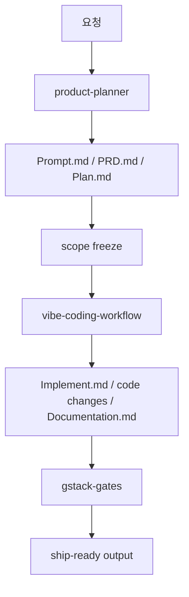

# Operating Model

vibebuilder-framework는 에이전트를 많이 붙이는 시스템이 아니다. 역할과 타이밍을 분리해, 각 단계의 판단을 더 쉽게 만드는 프레임워크다.

## 한 줄 정의

`PM-first planning -> single-writer execution -> gated review`

운영 강도는 `mode`로 조절하고, 평가 강도는 `oversight plan`으로 조절한다.

## 왜 이렇게 나누는가

- planner는 문제를 좁히는 데 강하다.
- writer는 실제 변경 책임을 한 곳에 모을 때 가장 빠르다.
- evaluator는 구현 후반에 품질을 올릴 때 가장 효율적이다.

이 세 역할을 섞으면, 생각은 많아지고 결정은 느려진다. 나누면 오히려 속도와 품질이 같이 올라간다.

## 레이어

| 레이어 | 역할 | 왜 필요한가 |
| --- | --- | --- |
| `AGENTS.md` | 항상 적용되는 헌법 | 저장소 전체 기준을 고정하기 위해 |
| `.agents/skills/` | 반복 절차 | 같은 판단과 행동을 재사용하기 위해 |
| `templates/` | 프로젝트 문서 출발점 | 매번 빈 문서에서 시작하지 않기 위해 |
| `docs/` | 운영 원리와 게이트 기준 | skill이 읽을 수 있는 참조 문서를 두기 위해 |
| `Subagent-Manifest.md` | 이번 프로젝트의 인력 배치표 | 역할과 write scope를 분명히 해야 할 때 쓰기 위해 |

## 기본 흐름

## 운영 기준

- 계획이 약하면 구현을 늦춘다.
- 구현이 시작되면 범위를 지킨다.
- 검토는 끝에서 강하게 한다.
- 기억은 파일에 남긴다.
- mode는 작업 크기와 리스크에 맞춘다.
- 감독 렌즈는 작업마다 planner가 동적으로 고른다.
- 구현 중 인사이트는 pivot 정책에 따라 흡수하거나 재계획한다.
- UI가 없는 작업에는 `validation`을 기본 검증 게이트로 사용한다.

## 예외 처리

작고 명백한 수정은 planner를 건너뛸 수 있다. 단, 아래는 유지한다.

- 한 줄 목표
- 수정 범위
- 검증 방법
- `Documentation.md` 기록

즉, 예외는 절차를 없애는 것이 아니라 절차를 줄이는 것이다.
